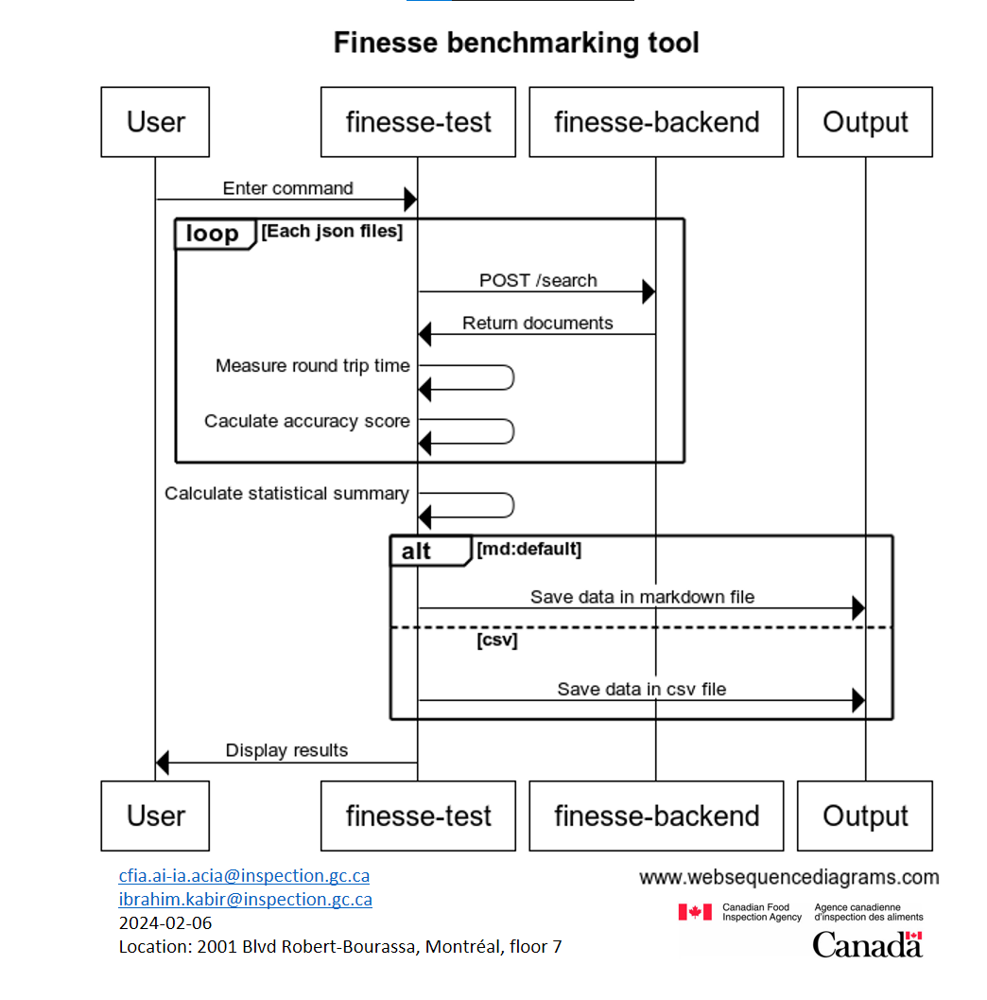

# Design of the Finesse Test Utility

## Tools available

There are tools that can integrate with Python or a script to accurately
calculate API statistics. Currently, the needs are to test the tool using JSON
files containing questions and their page origin in order to establish an
accuracy score. We also want to calculate request times and generate a
statistical summary of all this data. That being said, we plan to test the APIs
under different conditions in the near future. For example, with multiple
simultaneous users or under special conditions. That's why it's worth
researching tools, if they are scalable and well adapted with Python.

### Decision

The most promising tool we found was [**Locust**](https://github.com/locustio).
It seamlessly integrates with Python, making it a natural choice due to its
dependency availability. It offers several advantages, as outlined below.
However, **we decided to not use it** as its primary use case is to conduct
tests with identical repeatable requests involving simultaneous users or
machines and endpoints. Our specific testing requirements involve conducting
multiple tests with different headers each time, which deviates from the tool's
primary purpose of repeating the same test multiple times while adjusting user
load. Too much modification and work would be necessary to adapt our test
utility to Locust. Nevertheless, there is potential for future use where stress
and load testing involving repeated searches may be integrated.

### Alternatives Considered

#### Locust

Locust is an open-source load testing framework in Python, allowing simulation
of many concurrent users making requests to a given system, and
providing detailed results on the performance and scalability of that system.

Pros

- Python dependency
- Built-in UI
- Easy integration with test scripts.
- Incorporate statistics, including median response time and request error
  percentage
- Locust's versatility allows it to test any tool by allowing custom tests
- Locust is popular and open source, with support from major tech companies such
as Microsoft and Google
- Issues are actively managed on its GitHub repository
- Scalable, enabling easy testing of multiple scenarios with simultaneous users
or machines and endpoints

Cons

- Designed for scalability and to repeatable requests

#### Apache Bench (ab)

Apache Bench (ab) is a command-line tool for benchmarking HTTP servers. It is
included with the Apache HTTP Server package and is designed for simplicity and
ease of use.

Pros

- Simple to use.
- Good for basic testing.
- Easy integration with test scripts.

Cons

- May not be flexible enough for complex testing scenarios.
- Less performant for heavy loads or advanced testing.

#### Siege

Siege is a load testing and benchmarking tool that simulates multiple users
accessing a web server, enabling stress testing and performance evaluation.

Pros

- Supports multiple concurrent users, making it suitable for load testing.
- Allows for stress testing of web servers and applications.

Cons

- Lack of documentation, some arguments are not documented in their wiki.
- May have a steeper learning curve compared to simpler tools like Apache Bench.

## Overview

This tool simplifies the process of comparing different search engines and
assessing their accuracy. It's designed to be straightforward, making it easy
to understand and use.

## How it Works

- **Single command:**
  - Users can enter commands with clear instructions to choose a search engine,
    specify a directory for JSON files and specify the backend URL.
  - Mandatory arguments:
    - `--engine [search engine]`: Pick a search engine.
      - `ai-lab` : AI-Lab search engine
      - `azure`: Azure search engine
      - `static`: Static search engine
    - `--path [directory path]`: Point to the directory with files structured
    - `--backend [base API URL]`: Point to the finesse-backend URL
      with JSON files with the following properties:
      - `score`: The score of the page.
      - `crawl_id`: The unique identifier associated with the crawl table.
      - `chunk_id`: The unique identifier of the chunk.
      - `title`: The title of the page.
      - `url`: The URL of the page.
      - `text_content`: The main textual content of the item.
      - `question`: The question to ask.
      - `answer`: The response to the asked question.
  - Optional argument:
    - `--format [file type]`:
      - `csv`: generate a CSV document
      - `md`: generate a Markdown document, selected by default
- **Many tests**
  - Search all the JSON files in the directory
- **Accuracy score**
  - The tool compares the expected page with the actual Finesse response pages.
  - Calculates an accuracy score for each response based on its position in the
    list of pages relative to the total number of pages in the list. 100% would
    correspond of being at the top of the list, and 0% would mean not in the
    list.
- **Round trip time**
  - Measure round trip time of each request
- **Summary statistical value**
  - Measure the average, minimum and maximal accuracy scores and round trip time

## Diagram



## Example Command

```cmd
$finesse-test --engine azure --path "/qna-tests" -H "https://127.0.0.1"
Searching with Azure Search...

File: "qna_2023-12-08_15"
Question: "Quels sont les numéros de téléphone pour les demandes de r
enseignements du public?"
Accuracy Score: 70%
Time: 875ms

File: "qna_2023-12-08_17"
Question: "Quels sont les contacts pour les demandes de renseignements du public?"
Accuracy Score: 80%
Time: 786ms

---
Tested files: 2
Approximate round trip times in milli-seconds:
  Minimum = 786, Maximum = 875, Average = 831ms
Approximate Finesse Accuracy Score:
  Minimum = 70%, Maximum = 80%, Average = 75%
```

This example shows how the CLI Output of the tool, analyzing search results from
Azure Search and providing an accuracy score for Finesse.
